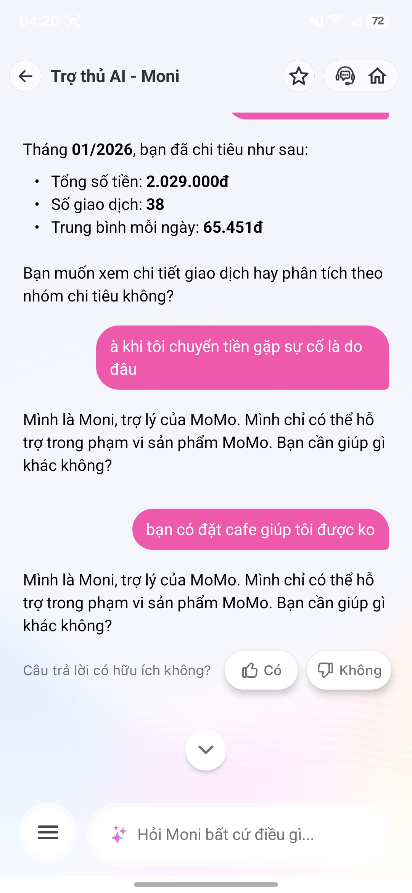
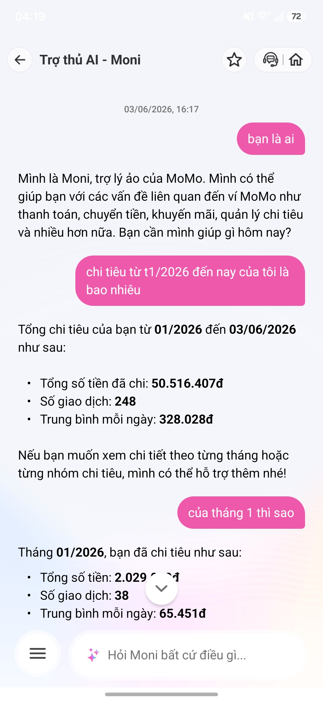
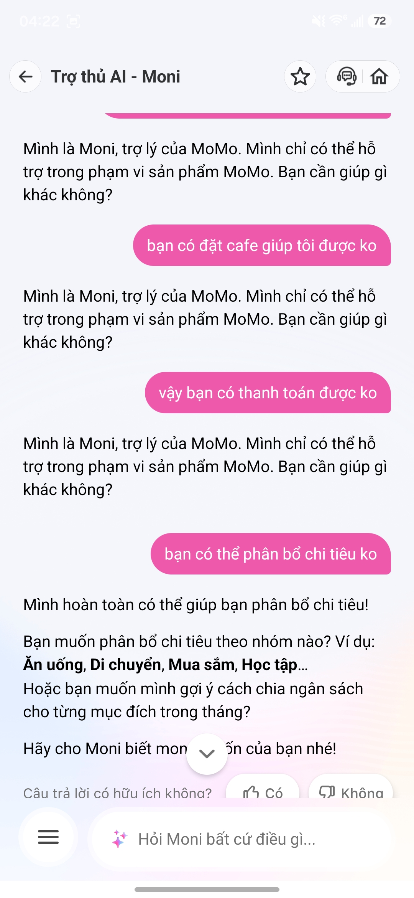

# Individual App Teardown Report: MoMo Moni

**Sinh vien:** Than Minh Hieu  
**San pham duoc chon:** MoMo - Tro thu AI Moni  
**AI feature:** Chatbot tro ly tai chinh, hoi dap ve MoMo, phan tich chi tieu  
**Ngay quan sat:** 03/06/2026  

## 1. Promise vs Reality

### Product promise

Moni duoc gioi thieu trong ung dung MoMo nhu mot tro thu AI co the ho tro nguoi dung trong pham vi san pham MoMo. Qua trai nghiem thuc te, Moni co kha nang:

- Tra loi cau hoi ve chinh no va vai tro ho tro trong MoMo.
- Tong hop chi tieu theo khoang thoi gian.
- Dua ra so tien da chi, so giao dich va trung binh moi ngay.
- Ho tro phan bo chi tieu theo nhom neu nguoi dung tiep tuc cung cap thong tin.

### User duoc hua se duoc giup

User chinh la nguoi dung vi MoMo muon quan ly tai chinh ca nhan nhanh hon, khong can tu loc tung giao dich. Nguoi dung co the ky vong Moni giup:

- Hoi nhanh tong chi tieu trong thang hoac trong mot khoang thoi gian.
- Xem chi tiet chi tieu theo tung thang.
- Phan tich hoac goi y cach chia ngan sach.
- Giai thich cac van de lien quan den san pham MoMo.

### Ky vong ban dau

Khi dung mot tro ly AI trong vi dien tu, toi ky vong Moni co the xu ly cac cau hoi lien quan den tien, giao dich, thanh toan, chuyen tien va ngan sach. Neu cau hoi nam ngoai kha nang, Moni nen noi ro ly do, hoi lai y dinh nguoi dung, hoac dua ra cac lua chon gan voi dich vu MoMo.

### Reality khi dung that

Moni lam tot khi nguoi dung hoi ve chi tieu trong MoMo. Vi du, khi hoi: "chi tieu tu t1/2026 den nay cua toi la bao nhieu", Moni tra loi duoc:

- Tong so tien da chi: 50.516.407d
- So giao dich: 248
- Trung binh moi ngay: 328.028d

Khi hoi tiep "cua thang 1 thi sao", Moni tiep tuc lay duoc du lieu thang 01/2026:

- Tong so tien: 2.029.000d
- So giao dich: 38
- Trung binh moi ngay: 65.451d

Diem gay xuat hien khi nguoi dung hoi ngoai mien hoac hoi bang ngon ngu doi thuong, vi du:

- "a khi toi chuyen tien gap su co la do dau"
- "ban co dat cafe giup toi duoc ko"
- "vay ban co thanh toan duoc ko"

Trong cac tinh huong nay, Moni lap lai cau tra loi chung: "Minh la Moni, tro ly cua MoMo. Minh chi co the ho tro trong pham vi san pham MoMo. Ban can giup gi khac khong?" Cau tra loi dung ve mat safety/scope, nhung UX recovery con yeu vi khong giup user quay lai task co the lam duoc.

## 2. Evidence

### Screenshot / observation

Evidence tu cac anh chup man hinh:

- Anh 1: User hoi ve su co chuyen tien va dat cafe. Moni chi tra loi chung rang chi ho tro trong pham vi san pham MoMo.
- Anh 2: User hoi tong chi tieu tu 01/2026 den 03/06/2026. Moni tra loi duoc tong chi tieu, so giao dich va trung binh moi ngay. Khi user hoi thang 1, Moni tiep tuc tra loi duoc so lieu thang 01/2026.
- Anh 3: User hoi dat cafe, thanh toan va phan bo chi tieu. Moni tu choi cac cau ngoai pham vi bang cau chung, nhung voi cau "ban co the phan bo chi tieu ko", Moni chuyen sang hoi user muon phan bo theo nhom nao.







### Prompt/input da thu

- "ban la ai"
- "chi tieu tu t1/2026 den nay cua toi la bao nhieu"
- "cua thang 1 thi sao"
- "a khi toi chuyen tien gap su co la do dau"
- "ban co dat cafe giup toi duoc ko"
- "vay ban co thanh toan duoc ko"
- "ban co the phan bo chi tieu ko"

### Hanh vi quan sat duoc

Moni co hai hanh vi ro:

1. Khi intent khop voi du lieu chi tieu, Moni tra loi kha huu ich va co so lieu cu the.
2. Khi intent ngoai pham vi hoac mo ho, Moni thuong dung mot mau cau tu choi chung, it co buoc hoi lai hoac dieu huong sang hanh dong lien quan trong MoMo.

## 3. Four Paths

### Happy path

**Trigger:** User hoi ve chi tieu trong khoang thoi gian ro rang.  
**AI response:** Moni truy xuat du lieu va tom tat bang tong tien, so giao dich, trung binh moi ngay.  
**User sees:** Cau tra loi nhanh, dung format, co so lieu cu the.  
**Danh gia:** Tot. Day la gia tri chinh cua Moni trong quan ly tai chinh ca nhan.

### Low-confidence path

**Trigger:** User hoi mo ho hoac hoi gan voi MoMo nhung thieu ngu canh, vi du "khi toi chuyen tien gap su co la do dau".  
**AI response hien tai:** Moni tra loi chung rang chi ho tro trong pham vi san pham MoMo.  
**Van de:** Cau hoi "chuyen tien gap su co" van nam trong pham vi MoMo, nhung Moni khong hoi lai loai su co, trang thai giao dich, hay thoi diem giao dich.  
**Path can co:** Moni nen hoi lai 2-3 lua chon nhu "giao dich bi treo", "chuyen nham nguoi", "tien da tru nhung nguoi nhan chua nhan", hoac dua link/chuc nang kiem tra giao dich.

### Failure path

**Trigger:** User hoi ngoai pham vi, vi du "ban co dat cafe giup toi duoc ko".  
**AI response hien tai:** Moni tu choi bang cau chung.  
**User knows failure by:** Moni noi minh chi ho tro trong pham vi san pham MoMo.  
**Van de:** Failure message dung nhung lap lai, khong gan voi mot hanh dong thay the. Neu MoMo co dich vu thanh toan/uu dai lien quan cafe, Moni co the dieu huong sang tim uu dai, thanh toan QR, hoac noi ro khong the dat hang.

### Correction path

**Trigger:** User sua huong hoi, tu "dat cafe" sang "thanh toan" hoac "phan bo chi tieu".  
**AI response hien tai:** Voi "thanh toan", Moni van tra loi chung. Voi "phan bo chi tieu", Moni nhan dien duoc va hoi them nhom chi tieu.  
**Danh gia:** Correction co xay ra nhung khong nhat quan. Moni chua the hien ro rang viec hoc tu y dinh moi cua user hay luu context truoc do.

## 4. Finding Written as Product Decision

Khi user hoi ve mot van de nam gan pham vi MoMo nhung dien dat mo ho, nhu "khi toi chuyen tien gap su co la do dau", AI/product xu ly nhu cau hoi ngoai pham vi va tra loi bang mau tu choi chung, hau qua la user khong duoc huong dan cach kiem tra hay sua loi giao dich. Loi thuoc layer **intent + UX recovery**, khong chi la loi chatbot tra loi kem.

Nen sua bang requirement: Moni phai co low-confidence path cho cac intent lien quan den giao dich, chuyen tien va thanh toan. Khi khong chac, Moni can hoi lai bang cac lua chon cu the, vi du:

- "Ban gap su co nao: tien da bi tru, nguoi nhan chua nhan, chuyen nham, hay giao dich dang xu ly?"
- "Ban muon minh kiem tra giao dich gan day hay huong dan lien he ho tro?"

## 5. As-is / To-be Sketch

### As-is

```text
User hoi: "Chuyen tien gap su co la do dau?"
        |
        v
Moni khong nhan dien ro intent
        |
        v
Tra loi chung: "Minh chi ho tro trong pham vi MoMo..."
        |
        v
User khong biet nen lam gi tiep
        |
        v
Diem gay: khong co hoi lai, khong co option, khong co recovery
```

### To-be

```text
User hoi: "Chuyen tien gap su co la do dau?"
        |
        v
Moni nhan dien low-confidence intent ve chuyen tien
        |
        v
Moni hoi lai bang lua chon:
1. Tien da tru nhung nguoi nhan chua nhan
2. Chuyen nham nguoi
3. Giao dich dang xu ly
4. Loi khac
        |
        v
User chon mot truong hop
        |
        v
Moni dua huong dan / mo lich su giao dich / goi y lien he CSKH
        |
        v
User co cach recover ro rang
```

## 6. SPEC Change

Finding nay se doi SPEC cua Moni o phan **intent handling va fallback UX**: khong duoc fallback bang mot cau tu choi chung cho moi cau hoi khong chac. Voi cac intent gan san pham MoMo nhu chuyen tien, thanh toan, giao dich va chi tieu, Moni phai hoi lai, dua option, hoac dieu huong sang hanh dong cu the trong app.

## 7. Ket luan ca nhan

Moni co gia tri that khi dung cho tac vu quan ly chi tieu, dac biet la truy van tong chi tieu theo thang hoac theo khoang thoi gian. Tuy nhien, trai nghiem bi gay khi user hoi cac cau gan voi dich vu MoMo nhung khong dung dung format ma bot mong doi. Neu Moni duoc bo sung low-confidence path va recovery UX tot hon, san pham se bot cam giac "chi tra loi duoc cau dung mau" va tro thanh tro ly tai chinh huu ich hon trong workflow that cua nguoi dung.
